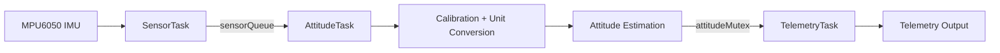

# Software Architecture

## Overview

This document describes the software architecture of the STM32 Nucleo-F446RE implementation of the MPU6050 attitude-estimation project.

The firmware is organized around STM32Cube-generated startup code, STM32 HAL peripheral drivers, FreeRTOS, and a modular application structure for the STM32F446RE. At a high level, the system repeatedly:

1. Reads raw accelerometer and gyroscope data from the MPU6050 over I2C
2. Applies calibration and unit conversion
3. Estimates roll and pitch
4. Sends telemetry over the configured serial interface

These responsibilities are split across three FreeRTOS tasks rather than a single loop, as described below.

---

## Data Flow

Raw sensor data is read from the MPU6050 by `SensorTask` and pushed onto a queue. `AttitudeTask` consumes each sample, applies calibration and unit conversion, computes the accelerometer and gyroscope estimates, and applies the complementary filter. The resulting attitude state is published under a mutex so that `TelemetryTask` can safely snapshot it and transmit telemetry independently of the estimation rate. The complementary filter is treated as part of the attitude-estimation stage rather than as a separate software module.

---

## Software Layers

### HAL and Board Support

This layer contains STM32Cube-generated startup code and peripheral configuration for the Nucleo-F446RE, including clock setup, GPIO, I2C, UART, and interrupt support.

The HAL provides the MCU-facing interface used by the application, including peripheral handles and APIs for initialization, timing, communication, and data transfer.

### Sensor Driver

The MPU6050 driver handles register-level communication with the sensor.

Its responsibilities include:

- Waking the MPU6050
- Configuring device registers
- Reading accelerometer and gyroscope data
- Verifying communication through `WHO_AM_I`
- Hiding low-level I2C transactions from the rest of the code

Typical files:

- `Core/Inc/mpu6050.h`
- `Core/Src/mpu6050.c`

### Calibration

The calibration module removes startup bias and converts raw sensor values into physical units.

Its responsibilities include:

- Collecting stationary startup samples
- Computing accelerometer biases
- Computing gyroscope biases
- Correcting the gravity offset on the accelerometer Z-axis
- Converting accelerometer data to g
- Converting gyroscope data to degrees per second

Typical files:

- `Core/Inc/calibration.h`
- `Core/Src/calibration.c`

### Attitude Estimation

The attitude module computes roll and pitch from calibrated sensor data.

Its responsibilities include:

- Computing accelerometer-based roll and pitch
- Integrating gyroscope angular velocity over time
- Applying the complementary filter
- Maintaining filtered roll and pitch state

Typical files:

- `Core/Inc/attitude.h`
- `Core/Src/attitude.c`

### FreeRTOS Task Layer

This layer implements the sensor acquisition, attitude estimation, and telemetry pipeline as three independent FreeRTOS tasks, coordinated through a queue and a mutex.

Its responsibilities include:

- Reading raw sensor samples on a fixed period and pushing them onto `sensorQueue`
- Consuming queued samples, updating calibrated attitude estimates, and publishing them under `attitudeMutex`
- Snapshotting the shared attitude state and transmitting CSV telemetry on a slower, independent period
- Detecting stack overflow and heap allocation failures through FreeRTOS hook functions

Typical files:

- `Core/Inc/app_tasks.h`
- `Core/Src/app_tasks.c`
- `Core/Src/freertos.c`

### Main Application

The main application coordinates startup and hands off execution to the FreeRTOS scheduler.

Its responsibilities include:

- Initializing the MCU and peripherals
- Starting and configuring the MPU6050
- Running calibration at startup
- Creating the shared queue, mutex, and application tasks
- Starting the FreeRTOS scheduler

Typical files:

- `Core/Src/main.c`
- `Core/Inc/main.h`

---

## Execution Flow

### Startup Sequence

A typical startup sequence is:

1. HAL and system initialization
2. Clock and peripheral configuration
3. MPU6050 initialization
4. Calibration
5. Initial attitude setup
6. Creation of the sensor queue, attitude mutex, and application tasks
7. Start of the FreeRTOS scheduler

Each stage depends on the previous one, so sensor reads and estimation begin only after the board, peripherals, and calibration are ready, and only once the scheduler has started running the tasks.

### FreeRTOS Task Architecture

Once the scheduler starts, three tasks run concurrently:

- **SensorTask** — Runs at a fixed 100 Hz period. Acquires raw accelerometer and gyroscope data from the MPU6050 and pushes a combined sample onto `sensorQueue`.
- **AttitudeTask** — Blocks on `sensorQueue`. For each received sample, applies calibration and unit conversion, computes the accelerometer and gyroscope estimates, applies the complementary filter, and publishes the updated attitude state under `attitudeMutex`.
- **TelemetryTask** — Runs at a fixed, slower period (10 Hz). Snapshots the shared attitude state under `attitudeMutex` and transmits a CSV telemetry line over UART.

Running telemetry at a lower priority and slower rate than sensing and estimation keeps UART transmission from interfering with the deterministic timing of sample acquisition and attitude updates.

This task-based pipeline replaces the single fixed-rate loop used in earlier versions of the STM32 firmware.

---

## Timing

Timing is especially important for gyroscope integration, because the quality of the estimate depends directly on the loop interval.

`SensorTask` runs on a fixed 100 Hz period using `vTaskDelayUntil()`, which keeps the sampling interval consistent even if individual iterations take slightly different amounts of time. `AttitudeTask` computes `dt` from this fixed sensor period rather than measuring elapsed time directly, since the sensor period is constant. `TelemetryTask` runs independently on its own fixed, slower period, so telemetry output rate is decoupled from the estimation rate.

---

## Telemetry

The final stage of the architecture is telemetry output, handled by `TelemetryTask`.

On each telemetry period, the task snapshots the current accelerometer estimate, gyroscope estimate, filtered estimate, and associated sample timestamp under `attitudeMutex`, then formats them into a compact CSV line and sends it over the configured serial interface. This keeps output separate from the sensing and estimation logic and makes the system easier to maintain.

---

## Module Summary

- **HAL / board layer**: configures the STM32 and its peripherals
- **MPU6050 driver**: communicates with the IMU over I2C
- **Calibration**: removes bias and converts to physical units
- **Attitude**: estimates roll and pitch and applies the complementary filter
- **FreeRTOS task layer**: runs sensing, estimation, and telemetry as independent tasks coordinated through a queue and a mutex
- **Main application**: initializes hardware, creates RTOS objects and tasks, and starts the scheduler

---

## References

- [NUCLEO-F446RE Product Page — STMicroelectronics](https://www.st.com/en/evaluation-tools/nucleo-f446re.html)
- [STM32F446RE Product Page — STMicroelectronics](https://www.st.com/en/microcontrollers-microprocessors/stm32f446re.html)
- [UM1725 - Description of STM32F4 HAL and low-layer drivers — STMicroelectronics](https://www.st.com/resource/en/user_manual/um1725-description-of-stm32f4-hal-and-lowlayer-drivers-stmicroelectronics.pdf)
- [HAL I2C APIs — STMicroelectronics](https://dev.st.com/stm32cube-docs/stm32u5-hal2/2.0.0-beta.1.1/docs/drivers/hal_drivers/i2c/hal_i2c_apis.html)
- [FreeRTOS Kernel Documentation — FreeRTOS.org](https://www.freertos.org/Documentation/00-Overview)
